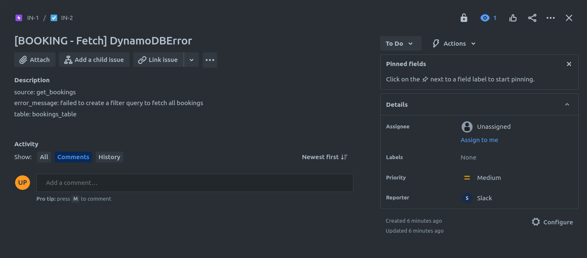
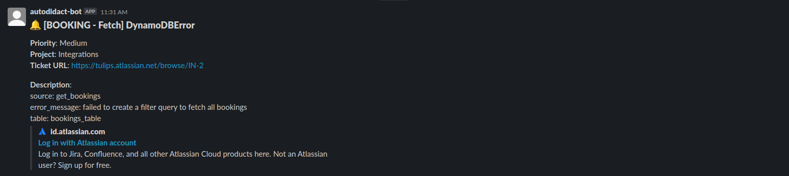

# JIRA + Slack Integration

A mini-project that uses AWS services to automate the creation of JIRA tickets/issues and send notifications to a designated Slack channel. The **API Gateway** acts as the entry point, receiving HTTP requests that trigger Lambda Functions. The **Lambda Functions** process the requests, creating JIRA tickets/issues based on the provided information. To ensure reliable and scalable processing, **Simple Queue Service (SQS)** is employed as a buffer between the API Gateway and the Lambda Functions. The processed tickets/issues are then published to the designated Slack channel, notifying the team members.

Please note that this mini-project serves as a demonstration of integrating AWS services such as API Gateway, Lambda Functions, and Simple Queue Service (SQS), for creating JIRA tickets/issues and sending notifications to a Slack channel. It is not intended for real-world production use and may lack certain features, optimizations, and security issues required for a production-ready application.

## JIRA Issue


## Slack Channel Notification


## Pre-requisites
* [JIRA Setup and Authentication](docs/app_integration/jira_setup.md)
* [Slack Setup and Authentication](docs/app_integration/slack_setup.md)
* [JIRA and Slack Secrets Manager Configuration](docs/app_integration/jira_slack_secrets_manager.md)

## Using `Makefile` to install, bootstrap, and deploy the project

1. Install all the dependencies and bootstrap your project
    ```bash
    dev@dev:~:bus-ticketing$ make init
    ```

    To initialize the project with specific AWS profile, you can pass a parameter called `profile`.
    ```bash
    dev@dev:~:bus-ticketing$ make init profile=profile_name
    ```

2. Deploy the project.
    ```bash
    dev@dev:~:bus-ticketing$ make deploy
    # Deploying with specific AWS profile
    dev@dev:~:bus-ticketing$ make deploy profile=profile_name
    ```

## Useful commands

* `go test`         run unit tests
* `cdk deploy`      deploy this stack to your default AWS account/region
* `cdk diff`        compare deployed stack with current state
* `cdk synth`       emits the synthesized CloudFormation template
* `cdk bootstrap`   deployment of AWS CloudFormation template to a specific AWS environment (account and region)
* `cdk destroy`     destroy this stack from your default AWS account/region
