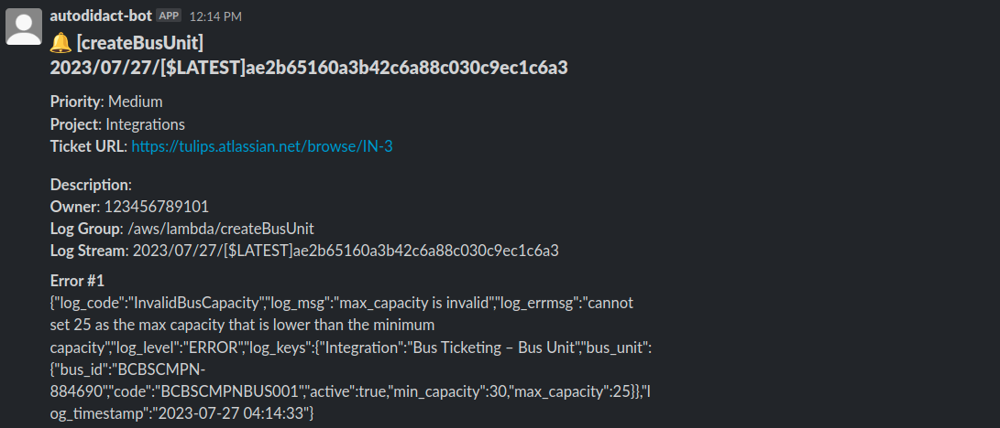

# JIRA + Slack Integration

A mini-project that uses AWS services to automate the creation of JIRA tickets/issues and send notifications to a designated Slack channel. The **API Gateway** acts as the entry point, receiving HTTP requests that trigger Lambda Functions. The **Lambda Functions** process the requests, creating JIRA tickets/issues based on the provided information. To ensure reliable and scalable processing, **Simple Queue Service (SQS)** is employed as a buffer between the API Gateway and the Lambda Functions. The processed tickets/issues are then published to the designated Slack channel, notifying the team members.

Please note that this mini-project serves as a demonstration of integrating AWS services such as API Gateway, Lambda Functions, and Simple Queue Service (SQS), for creating JIRA tickets/issues and sending notifications to a Slack channel. It is not intended for real-world production use and may lack certain features, optimizations, and security issues required for a production-ready application.

## Architecture
### JIRA + Slack Integration


#### JIRA Issue


#### Slack Channel Notification


### CloudWatch Lambda Subscription


#### JIRA Issue


#### Slack Channel Notification


## Pre-requisites
* [JIRA Setup and Authentication](docs/app_integration/jira_setup.md)
* [Slack Setup and Authentication](docs/app_integration/slack_setup.md)
* [JIRA and Slack Secrets Manager Configuration](docs/app_integration/jira_slack_secrets_manager.md)
* [CloudWatch Alert Secrets Manager Configuration](docs/app_integration/cloudwatch_alert_secrets_manager.md)

## API Usage and Specification
* [JIRA Integration API](docs/api_usage/jira_api.md)
    * [Get all JIRA Users](docs/api_usage/jira_api.md#get-all-jira-users)
    * [Get JIRA Project Details](docs/api_usage/jira_api.md#get-jira-project-details)
    * [Get all Issue Priorities](docs/api_usage/jira_api.md#get-all-issue-priorities)
    * [Create a JIRA Issue](docs/api_usage/jira_api.md#create-a-jira-issue)

## CloudWatch Lambda Subscription
1. Grant CloudWatch Logs permission to execute the Lambda Function. Replace the placeholder `account_id` with your account, and `region` with your desired region.
    ```bash
    dev@dev:~$ aws lambda add-permission \
    --function-name "log-subscription" \
    --statement-id "log-subscription" \
    --principal "logs.amazonaws.com" \
    --action "lambda:InvokeFunction" \
    --source-arn "arn:aws:logs:region:account_id:log-group:*:*" \
    --source-account "account_id"
    ```

2. Create a Lambda Subscription Filter.
    * **Using AWS Console**
        * Go to **CloudWatch** → **Logs** → **Log groups** → *Log Group Name*
        * Go to **Subscription filters** → **Create** → **Create Lambda subscription filter**
        * Choose the Lambda function for the destination that you want to subscribe to the filter
        * Configure log format and filters
            * Sample configuration of log format and filters
                * **Log format**: JSON
                * **Subscription filter format**: `{$.log_level="ERROR"}`

    * **Using AWS CLI**
        * Create a subscription filter using the following command and replace the placeholder `account_id` with your account, `region` with your desired region, `log_group_name` with the log group to process, and `filter_pattern` with your desired pattern.
        
            ```bash
            dev@dev:~$ aws logs put-subscription-filter \
            --log-group-name "log_group_name" \
            --filter-name "log-error-subscription" \
            --filter-pattern "filter_pattern" \
            --destination-arn "arn:aws:lambda:region:account_id:function:log-subscription"
            ```

## Using `Makefile` to install, bootstrap, and deploy the project

1. Install all the dependencies and bootstrap your project
    ```bash
    dev@dev:~:bus-ticketing$ make init
    ```

    To initialize the project with specific AWS profile, you can pass a parameter called `profile`.
    ```bash
    dev@dev:~:bus-ticketing$ make init profile=profile_name
    ```

2. Deploy the project.
    ```bash
    dev@dev:~:bus-ticketing$ make deploy
    # Deploying with specific AWS profile
    dev@dev:~:bus-ticketing$ make deploy profile=profile_name
    ```

## Useful commands

* `go test`         run unit tests
* `cdk deploy`      deploy this stack to your default AWS account/region
* `cdk diff`        compare deployed stack with current state
* `cdk synth`       emits the synthesized CloudFormation template
* `cdk bootstrap`   deployment of AWS CloudFormation template to a specific AWS environment (account and region)
* `cdk destroy`     destroy this stack from your default AWS account/region
