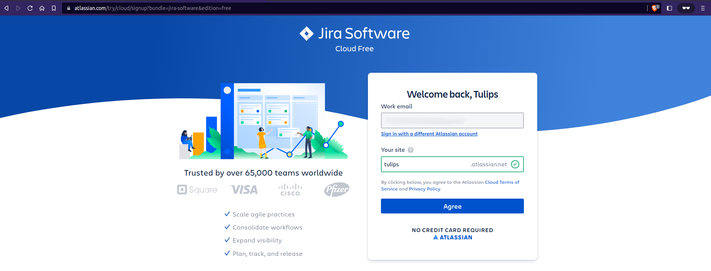

# JIRA Setup and Authentication

### Setup an Atlassian Account
1. Go to https://id.atlassian.com/signup.
2. You can have the option to sign up by **Enter your email** or continue with **Google**, **Microsoft**, etc.
3. To complete the setup, Atlassian will send an e-mail verification.

    a. If you don't see the verification e-mail, check your spam folder.

    b. If you still don't see the verification e-mail, return to the login screen to resend the e-mail.

4. After completing the process, it will redirect to https://start.atlassian.com/.
    

5. Select the **Jira Software** and click on **Get it free**.
    

6. You may be asked if you want to select a second product. After you decide whether or not to do that, click **Next**.
    

7. From **Work email**, enter the e-mail address you're going to use for this product and **Your site** name and click on **Agree**.
    

8. Now, Jira will show you the templates to select for your first project. Select the **Kanban (POPULAR)** project template.
    

9. Enter the project **Name** and **Create project**.
10. After the setup completion, it will be redirected to your project timeline page.
    

11. After setting up the project, go to the project settings **Issue types**.

    a. **Project settings** → **Issue types**

12. For each **Issue types**, add the **Priority** field and **Save changes**.
    

### Create the JIRA API Token
An **API Token** is required to authenticate a script or other process with an Atlassasian Cloud Product.
1. Log in to the Atlassian platform to access Jira Cloud or click [here](https://id.atlassian.com/manage-profile/security/api-tokens) to directly open the page to create the API token.
2. Go to **Settings** → **Atlassian account settings** → **Security** → **API token**.
    

3. Click on "**Create API token**".
  
    a. Enter a distinctive and concise **Label** for your token in the window that display, then click **Create**.

4. Copy the token to your clipboard.

    > **NOTE**:
    >
    >  * For security reasons it isn't possible to view token after closing the creation dialog; if necessary, create a new token.
    >  * You should store the token securely, just as for any password.

### Use an API Token
1. Create a string that has a format of *user_email:api_token*.
2. Encode the string using Base64 encoding.

    **For Linux/MacOS**
    ```bash
    echo -n user@example.com:api_token | base64
    ```

    **For Windows 7 and later, using Microsoft Powershell**
    ```shell
    $Text = ‘user@example.com:api_token_string’
    $Bytes = [System.Text.Encoding]::UTF8.GetBytes($Text)
    $EncodedText = [Convert]::ToBase64String($Bytes)
    $EncodedText
    ```

3. Supply an `Authorization` header with content `Basic` followed by the encoded string.
    ```bash
    curl -D- \
      -X GET \
      -H "Authorization: Basic ZnJlZDpmcmVk" \
      -H "Content-Type: application/json" \
      "https://your-domain.atlassian.net/rest/api/2/issue/issue-id"
    ```

## Reference
* [Create an Atlassian account](https://support.atlassian.com/atlassian-account/docs/create-an-atlassian-account/)
* [Get started in Jira Software](https://www.atlassian.com/software/jira/guides/getting-started/basics#step-1-create-a-project)
* [Manage API tokens for your Atlassian account](https://support.atlassian.com/atlassian-account/docs/manage-api-tokens-for-your-atlassian-account/)